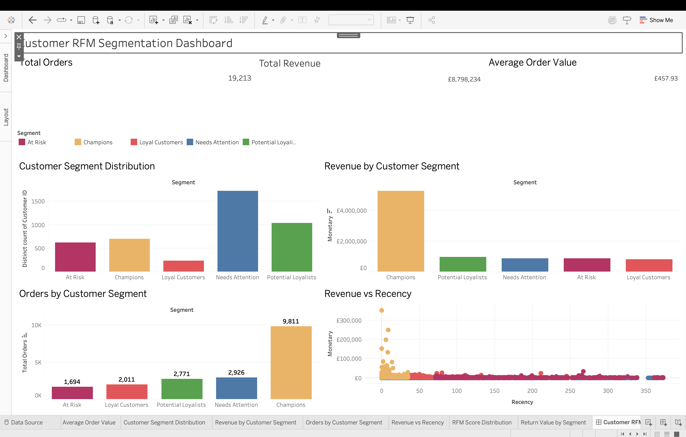

# Customer RFM Segmentation & Retail Analytics

## Overview

This project analyzes customer purchasing behavior using the **Online Retail II** dataset and applies **RFM (Recency, Frequency, Monetary) analysis** to segment customers based on their buying patterns.

I used **Python for data cleaning and analysis** and **Tableau Desktop for visualization**. The final dashboard is designed to give a quick view of customer value, purchasing activity, and segments that may need different retention strategies.

## Business Question

The main question behind the project was:

> **How can transaction data be used to identify different types of customers and help a business prioritize retention efforts?**

## Dataset

The analysis uses the **Online Retail II** dataset, focusing on transactions from **2009–2010**.

The dataset contains information such as:

- Invoice
- Stock Code
- Product Description
- Quantity
- Invoice Date
- Price
- Customer ID
- Country

## Data Preparation

I cleaned the transaction data in Python using Pandas before carrying out the customer-level analysis.

The main cleaning steps were:

- Removed duplicate records
- Handled missing Customer IDs
- Removed negative/invalid sales quantities
- Calculated transaction revenue
- Converted invoice dates into datetime format
- Aggregated transactions by customer
- Prepared the final dataset for Tableau

## RFM Analysis

I used three metrics to understand customer behavior:

| Metric | What it measures |
|---|---|
| **Recency** | How recently a customer purchased |
| **Frequency** | How often a customer placed orders |
| **Monetary** | How much revenue a customer generated |

Customers were scored across these three dimensions and assigned to five segments.

## Customer Segments

**Champions**  
Recent, frequent and high-value customers.

**Loyal Customers**  
Customers with strong purchasing frequency and monetary value.

**Potential Loyalists**  
Recently active customers who have the potential to become more loyal.

**At Risk**  
Customers showing weaker recent activity despite having previous purchasing value or frequency.

**Needs Attention**  
Customers with relatively weaker RFM characteristics who may require re-engagement.

## Results

The final customer-level analysis contains:

- **4,312 customers**
- **19,213 orders**
- **£8.80M total revenue**
- **£457.93 average order value**

### Customer Segments

| Segment | Customers |
|---|---:|
| Needs Attention | 1,722 |
| Potential Loyalists | 1,036 |
| Champions | 699 |
| At Risk | 622 |
| Loyal Customers | 233 |

## Tableau Dashboard

The dashboard was created in **Tableau Desktop** and includes:

- Total Orders
- Total Revenue
- Average Order Value
- Customer Segment Distribution
- Revenue by Customer Segment
- Orders by Customer Segment
- Revenue vs Recency
- RFM Score Distribution
- Return Value by Customer Segment

### Dashboard Preview



## Key Takeaways

The segmentation shows that the customer base is not uniform. A relatively small group of high-value customers can be separated from customers who are active but have not yet developed strong purchasing frequency or value.

The **At Risk** and **Needs Attention** groups can be used to identify customers for re-engagement campaigns, while **Champions** and **Loyal Customers** can be prioritized for retention and relationship-building activities.

## Tools Used

- Python
- Pandas
- NumPy
- Matplotlib
- Excel
- Tableau Desktop

## Project Files

| File | Description |
|---|---|
| `rfm_customer_segmentation.py` | Python script used for data cleaning, RFM analysis and segmentation |
| `Online_Retail_RFM_Tableau_v2.xlsx` | Final customer-level dataset |
| `Customer_RFM_Segmentation_Dashboard.twbx` | Tableau Desktop workbook |

## Project Workflow

```text
Raw Transaction Data
        ↓
Data Cleaning
        ↓
Customer-Level Aggregation
        ↓
RFM Calculation
        ↓
RFM Scoring
        ↓
Customer Segmentation
        ↓
Tableau Dashboard
